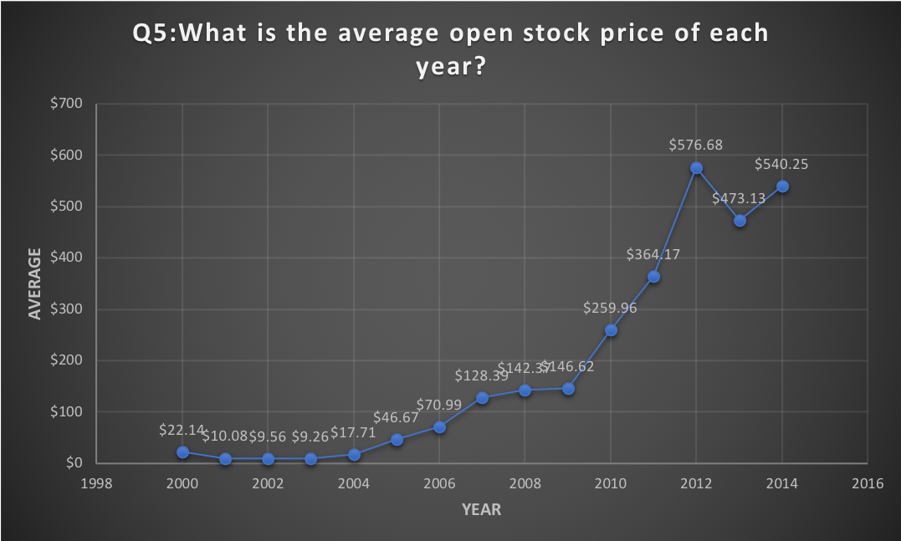

# Apple Stock Price
Description:

## Questions #1:
Which 10 dates have the highest close stock price in 2013?
```sql
SELECT date,
max(close) as Highest_Close_Price
From datasets.aapl_historical_stock_price
where year = 2013
group by date
order by Highest_Close_Price DESC
limit 10
```


## Questions #2:
Which 10 dates have the lowest stock price in 2012?
```sql
SELECT date,
min(low) as Lowest_Stock_Price
From datasets.aapl_historical_stock_price
where year = 2012
group by date
order by Lowest_Stock_Price ASC
limit 10
```


## Questions #3:
Which 10 dates have the highest volume in 2013?
```sql
SELECT date,
max(volume) as Highest_volume
From datasets.aapl_historical_stock_price
where year = 2013
group by date
order by Highest_volume DESC
limit 10
```


## Questions #4:
Which 10 dates have the lowest open price in 2012?
```sql
SELECT date,
min(open) as Lowest_Open_Price
From datasets.aapl_historical_stock_price
where year = 2012
group by date
order by Lowest_Open_Price ASC
limit 10
```


## Questions #5:
What is the average open stock price of each year?
```sql
SELECT
avg(open) as Avg_Open_Price, year
From datasets.aapl_historical_stock_price
group by year
order by year ASC
```


